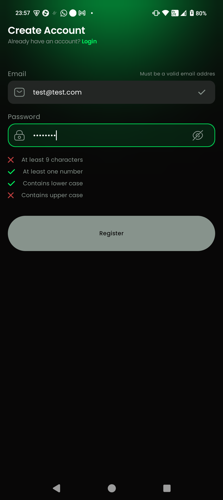
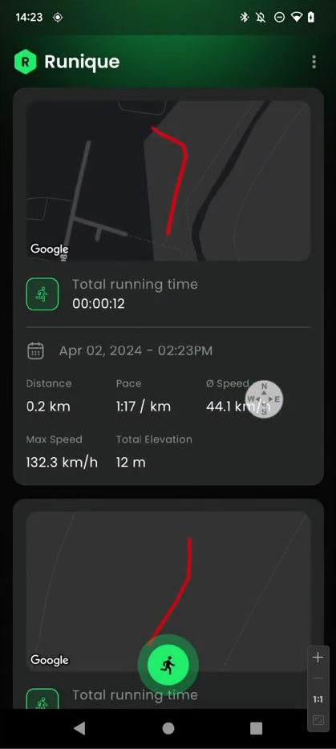
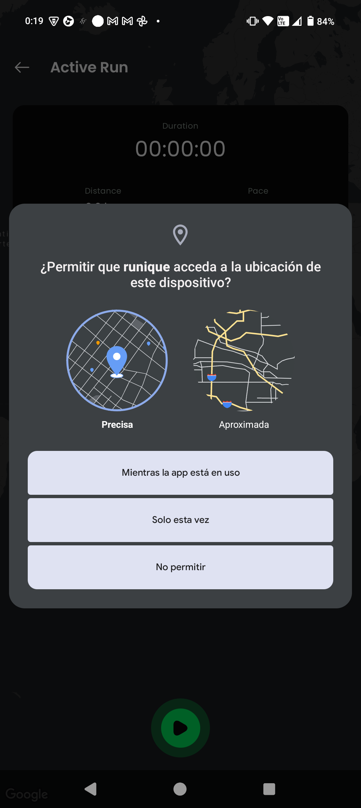
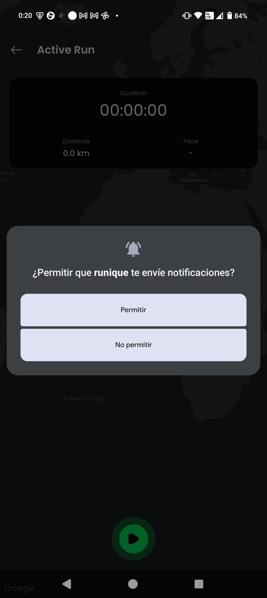
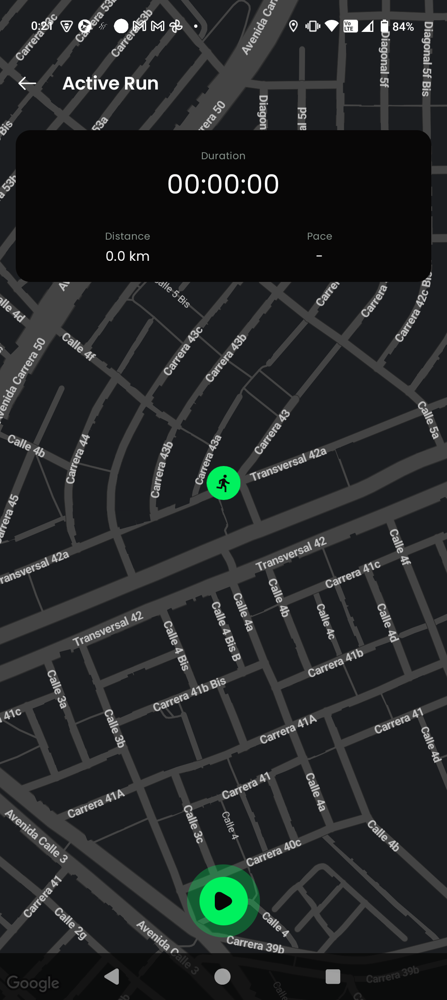
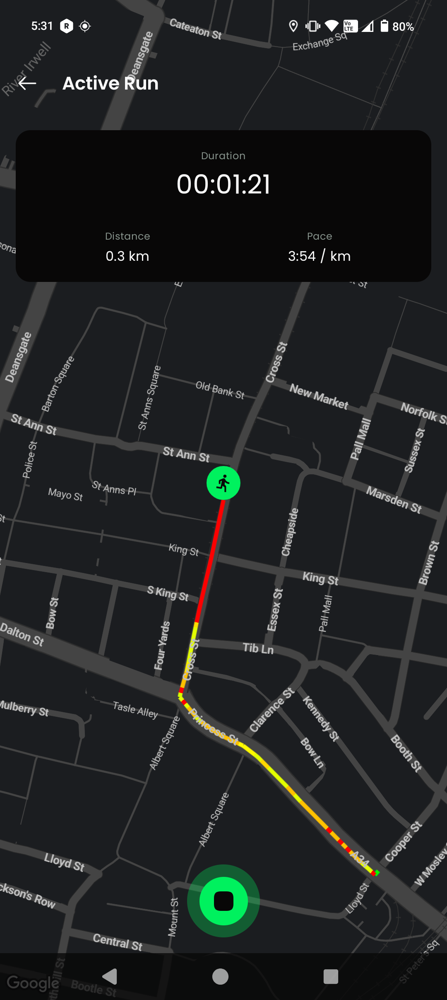
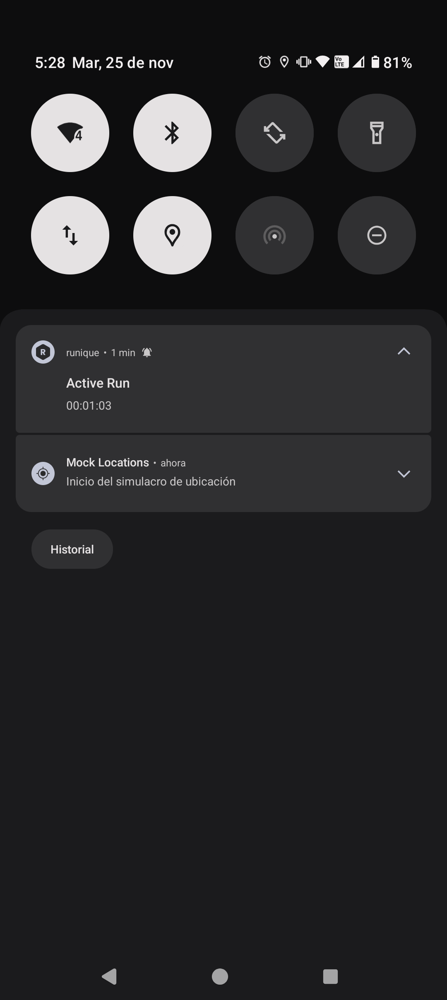
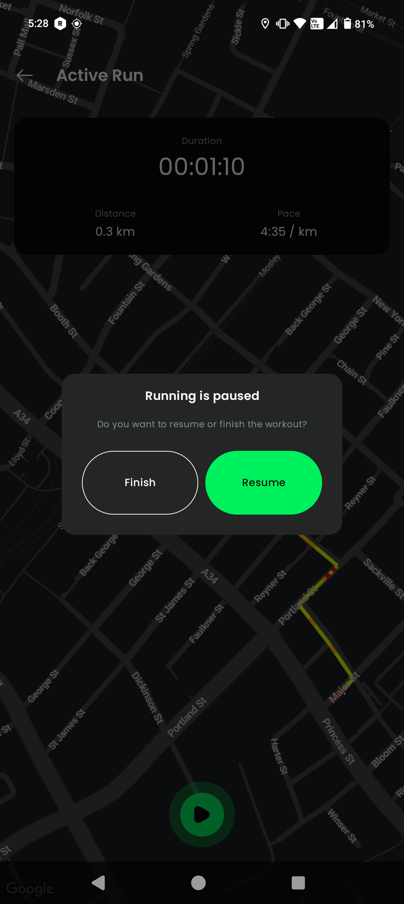

#  Runique App

Runique is a fitness tracking Android application built with Kotlin and Jetpack Compose. The
application enables users to track running activities with GPS location tracking, view run history,
and synchronize data across devices. The app follows modern Android development practices
including multi-module architecture, clean architecture patterns, and offline-first data management.

# 🚀 Features

- **User Authentication**: Secure registration and login with encrypted session storage
- **GPS Run Tracking**: Real-time activity tracking with distance, pace, and elevation metrics
- **Offline-First Architecture**: All data persists locally first, with background synchronization
- **Run History**: View and analyze past running activities
- **Analytics Dashboard**: Detailed statistics and insights (dynamic feature module)
- **Background Service**: Continuous tracking even when app is in background

# 📸 Screenshots

## Intro & Login/Registration Screens

<p align="center">


</p>

## Run Overview & Permission Screens
<p align="center">




</p>

## Active Run Tracking & Run History Screens
<p align="center">




</p>

# 🖲️ Tech Stack

### Core Technologies

- **Kotlin** 2.1.21 with Coroutines 1.9.0
- **Jetpack Compose** with Material Design 3
- **Koin** 4.0.0 for dependency injection

### Data & Networking

- **Room** 2.8.3 for local database
- **Ktor Client** 2.3.11 for API communication
- **WorkManager** for background synchronization
- **Security Crypto** for encrypted storage

### Location & Maps

- **Google Play Services Location**
- **Google Maps Compose** for map visualization

### Testing

- **JUnit 5** with AssertK, Turbine, and MockK

# 🏛️ Architecture

Runique follows a multi-module, clean architecture approach with these core principles:

- **Feature Isolation**:    Each feature (auth, run, analytics) is a self-contained set of modules
- **Dependency Inversion**:    All features depend on core domain interfaces, not concrete
  implementations
- **Layer Separation**:    Strict separation between `presentation` → `domain` ← `data` layers
- **Offline-First**:    Local data sources are the source of truth; remote sync is secondary
- **Modular Testing**:    Test utilities in `core:test` and `core:android-test` are shared across
  modules
- **Build Standardization**:    Custom Gradle convention plugins enforce consistent configurations

### Key Architectural Patterns

- **Multi-module architecture** with feature-based separation<cite />
- **Offline-first data strategy** with local database as source of truth<cite />
- **Clean Architecture layers**: Domain, Data, and Presentation<cite />
- **Repository pattern** with offline-first implementation<cite />

# 𝌮 Layer Responsibilities

## 🎨 1. Presentation Layer

**Location:**  
`:auth:presentation`, `:run:presentation`, `:analytics:presentation`

### Responsibilities

- UI state management via **ViewModels**
- Handling user actions
- UI rendering using **Jetpack Compose**
- **Dependencies:** Only depends on *domain interfaces*, never concrete implementations

### Example

```kotlin
class RunOverviewViewModel(
    private val runRepository: RunRepository,        // Domain interface
    private val syncRunScheduler: SyncRunScheduler,  // Domain interface
    private val sessionStorage: SessionStorage        // Domain interface
) : ViewModel()
```

## 🧠 2. Domain Layer

Location: `:auth:domain`, `:run:domain`, `:analytics:domain`, `:core:domain`

Responsibilities:

- Define repository and data source interfaces
- Contain pure business logic and domain models
- No Android framework dependencies
- Use type-safe error handling (Result<T, E>)

Dependencies: None — pure Kotlin/Java

Key Components:

- **Interfaces:** Contracts for data operations
- **Domain Models:** Pure data classes (e.g., Run, Location)
- **Domain Services:** Business logic utilities

## 📊 3. Data Layer

Location: `:auth:data`, `:run:data`, `:run:network`, `:core:data`, `:core:database`

Responsibilities:

- Implement domain interfaces with concrete technologies
- Coordinate local (Room) and remote (Ktor) data sources
- Data mapping between layers (DTOs ↔ Domain Models ↔ Entities)
- Offline-first synchronization logic

Example:

```kotlin
class OfflineFirstRunRepository(
    private val localRunDataSource: LocalRunDataSource,  // Domain interface  
    private val remoteRunDataSource: RemoteRunDataSource  // Domain interface  
) : RunRepository
```

# Dependency Rules

| **Layer**    | **Can Depend On**          | **Cannot Depend On**                          |
|--------------|----------------------------|-----------------------------------------------|
| Presentation | Domain interfaces & models | Data implementations, Database entities, DTOs |
| Domain       | Nothing (pure Kotlin)      | Presentation, Data, Android Framework         |
| Data         | Domain interfaces & models | Presentation layer                            |

# 📲 How To Run

### Prerequisites

- Android Studio Hedgehog or later
- JDK 17 or later
- Android SDK with API 24-35 support<cite />
- Google Maps API key (for map features)

### Setup

1. Clone the repository:

```bash  
git clone https://github.com/JohanAponte/runique.git  
cd runique
```

2. Open the project in Android Studio.
3. Create a `local.properties` file in the root directory and add your Google Maps API key:

```properties
googleMapsApiKey=YOUR_API_KEY
```

4. Build and run the app on an emulator or physical device.
5. Register a new account and start tracking your runs!
6. (Optional) To run tests, use the Gradle tasks:

```bash
./gradlew test           # Run unit tests
./gradlew connectedAndroidTest  # Run instrumentation tests
```